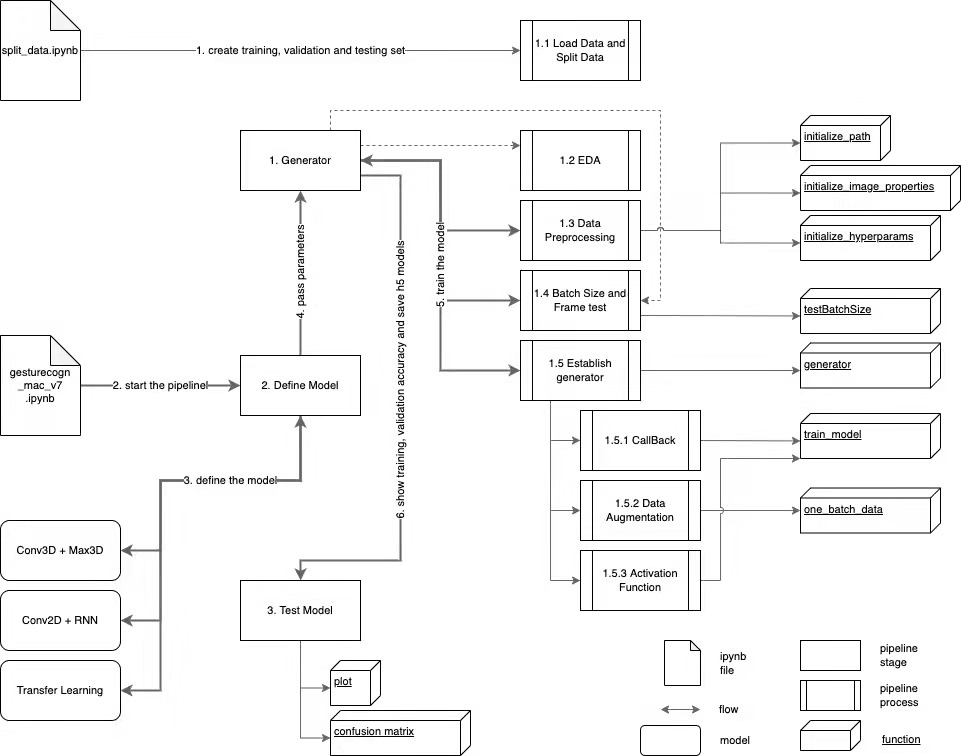
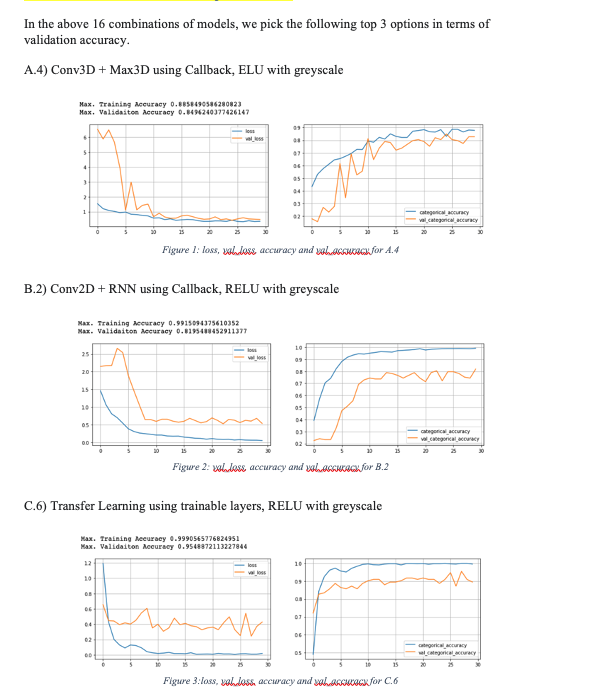

# MMAI894 - Team College: Hand Gestures Classification

- [Introduction](#introduction)
- [Data Source](#data_source)
- [Environment Setup](#env_setup)
   - [To Install Python](#install_python)
   - [To Create Virutal Environment](#create_virtual_environment)
   - [To Activate / Deactivate Virtual Environment](#activate_virtual_environment)
- [Project Setup](#project_setup)
   - [To Install Dependencies into our virtual environment](#install_dependencies)
   - [To Merge Data Batches into a File](#merge_data)
- [Run the Project](#run_project)
   - [Model Pipeline](#model_pipeline)
- [Project Result](#project_result)
- [Contact Us](#contact_us)

## Introduction<a name="introduction"></a>
Nowadays, technology has a pivotal role in creating virtual environments with virtual elements. We work collaboratively with real-world intelligent objects on a day-to-day basis. Innovations like the Internet of things (IoT) products, gesture recognition, and teleportation application have certainly made our life "smarter" and more accessible.

Embracing an "implementing a smarter life" mindset, Team College aims to develop a cool feature in the smart TV that can recognize five different gestures performed by the user to help users control the TV without using a remote. Based on this dataset, Team College wants to develop a well-rounded deep learning gesture recognition model which has applications in a spectrum of different industries beyond smart-TV.

## Data Source<a name="data_source"></a>
The training data consists of a few hundred videos categorized into one of the five classes. Each video (typically 2-3 seconds long) is divided into a sequence of 30 frames(images). Various people have recorded these videos performing one of the five gestures in front of a webcam - similar to what the smart TV will use. 
The data file contains a 'train', a 'test', and a 'val' folder with three CSV files for the three folders. These folders are, in turn, divided into subfolders where each subfolder represents a video of a particular gesture. Each subfolder, i.e., a video, contains 30 frames (or images). Note that all images in a particular video subfolder have the exact dimensions, but different videos may have different dimensions. Specifically, videos have two dimensions - either 360x360 or 120x160 (depending on the webcam used to record the videos). Hence, some pre-processing to standardize the videos will be needed. 
 Each row of the CSV file represents one video and contains three main pieces of information - the name of the subfolder containing the 30 images of the video, the name of the gesture, and the numeric label (between 0-4) of the video.

## Environment Setup<a name="env_setup"></a>

This project can work on MacOS, Window and Linux. And we develop our code based on [`Python 3`](https://www.python.org/downloads/) instead of `Python 2`.
All our codes can fully run on Python 3.8.5

### To Install Python<a name="install_python"></a> 

If you are the first time to use python, we suggest you to install python version management: `pyenv`. It helps us to install different versions of Python on our machines. Moreover, it allows us to setup a dedicated Python version in a specific folder.

To install pyenv, MacOS or Linux users can make use of [`brew`](https://brew.sh/). For Window users, please visit its [GitHub link](https://github.com/pyenv/pyenv) for installation details.

```bash
brew install pyenv
```

Then, we can install the Python 3.8.5 by using `pyenv`.

```bash
pyenv install 3.8.5
```

We can verify the result with `versions`.

```bash
pyenv versions
```

If success, it will return the following line but it is not activated yet. 

```bash
* system (set by /Users/andrng/.pyenv/version)
  3.8.5
```

Please create a folder `[folder name]` on any desired location. For the ease of demostration, we create a `temp` under `Desktop` by following commands.

```bash
cd Desktop
mkdir temp
cd temp
```

We can ensure Python `3.8.5` is not activated by using `Python3` or `Python2` as below. It may be different to your machines but the version numbers return from 2 commands should be different.

```bash
❯ python3 -V
Python 3.9.9
❯ python2 -V
Python 2.7.18
```

Now, we are going to activate Python 3.8.5 inside this temp folder. If you want to activate 3.8.5 globally across your machine, Please replace `local` term with `global`.

```bash
pyenv local 3.8.5
```

We can check with `versions` again.

```bash
  system (set by /Users/andrng/.pyenv/version)
* 3.8.5
```

### To Create Virtual Environment<a name="create_virtual_environment"></a>

After the installation of the correct Python version, we are going to create a virtual environment for our project. A virtual environment is needed for placing our project dependencies into a separate folder without messing up our global environment. First of all, we need `PIP` to install `virtualenv` before we can create the virtual environment in our project folder

```bash
cd Desktop/temp
pip install virtualenv
```

Now, we can create our environment by specifying our `Python 3.8.5` with `virtualenv` package.

```bash
virtualenv -p python3.8.5 .penv
```

We can confirm `.penv` is created by issuing the `ls -la` command.

```bash
ls -la
```

It shall list out the following items under your empty folder if it success.

```bash
drwxr-xr-x  15 andrng  staff      480 25 Mar 23:29 .
drwxr-xr-x   4 andrng  staff      128 25 Mar 18:20 ..
drwxr-xr-x   8 andrng  staff      256 25 Mar 19:36 .penv
-rw-r--r--   1 andrng  staff        6 25 Mar 19:31 .python-version
```

### To Activate / Deactivate Virtual Environment<a name="activate_virtual_environment"></a>

We have to activate our newly created virtual environment. It is important because it ensures that we install all project dependencies into `.penv/bin` folder from now on

```bash
source .penv/bin/activate
```

We can install `ipykernel` package in our virutal environment for creating a new and empty kernel.

```bash
pip install ipykernel
```

If it success, similar message shall be return as below

```bash
Collecting ipykernel
  Using cached ipykernel-6.9.2-py3-none-any.whl (130 kB)
Collecting nest-asyncio
  Using cached nest_asyncio-1.5.4-py3-none-any.whl (5.1 kB)
Collecting appnope
  Using cached appnope-0.1.2-py2.py3-none-any.whl (4.3 kB)
Collecting ipython>=7.23.1
  Using cached ipython-8.1.1-py3-none-any.whl (750 kB)
Collecting debugpy<2.0,>=1.0.0
  Downloading debugpy-1.6.0-cp38-cp38-macosx_10_15_x86_64.whl (1.7 MB)
     ━━━━━━━━━━━━━━━━━━━━━━━━━━━━━━━━━━━━━━━━ 1.7/1.7 MB 16.7 MB/s eta 0:00:00
Collecting jupyter-client<8.0
  Using cached jupyter_client-7.1.2-py3-none-any.whl (130 kB)
Collecting tornado<7.0,>=4.2
  Using cached tornado-6.1-cp38-cp38-macosx_10_9_x86_64.whl (416 kB)
Collecting traitlets<6.0,>=5.1.0
  Using cached traitlets-5.1.1-py3-none-any.whl (102 kB)
Collecting psutil
  Using cached psutil-5.9.0-cp38-cp38-macosx_10_9_x86_64.whl (238 kB)
Collecting matplotlib-inline<0.2.0,>=0.1.0
  Using cached matplotlib_inline-0.1.3-py3-none-any.whl (8.2 kB)
Collecting prompt-toolkit!=3.0.0,!=3.0.1,<3.1.0,>=2.0.0
  Using cached prompt_toolkit-3.0.28-py3-none-any.whl (380 kB)
Requirement already satisfied: setuptools>=18.5 in ./.penv/lib/python3.8/site-packages (from ipython>=7.23.1->ipykernel) (60.10.0)
Collecting decorator
  Using cached decorator-5.1.1-py3-none-any.whl (9.1 kB)
Collecting pexpect>4.3
  Using cached pexpect-4.8.0-py2.py3-none-any.whl (59 kB)
Collecting pygments>=2.4.0
  Using cached Pygments-2.11.2-py3-none-any.whl (1.1 MB)
Collecting backcall
  Using cached backcall-0.2.0-py2.py3-none-any.whl (11 kB)
Collecting stack-data
  Using cached stack_data-0.2.0-py3-none-any.whl (21 kB)
Collecting jedi>=0.16
  Using cached jedi-0.18.1-py2.py3-none-any.whl (1.6 MB)
Collecting pickleshare
  Using cached pickleshare-0.7.5-py2.py3-none-any.whl (6.9 kB)
Collecting entrypoints
  Using cached entrypoints-0.4-py3-none-any.whl (5.3 kB)
Collecting python-dateutil>=2.1
  Using cached python_dateutil-2.8.2-py2.py3-none-any.whl (247 kB)
Collecting pyzmq>=13
  Using cached pyzmq-22.3.0-cp38-cp38-macosx_10_9_x86_64.whl (1.3 MB)
Collecting jupyter-core>=4.6.0
  Using cached jupyter_core-4.9.2-py3-none-any.whl (86 kB)
Collecting parso<0.9.0,>=0.8.0
  Using cached parso-0.8.3-py2.py3-none-any.whl (100 kB)
Collecting ptyprocess>=0.5
  Using cached ptyprocess-0.7.0-py2.py3-none-any.whl (13 kB)
Collecting wcwidth
  Using cached wcwidth-0.2.5-py2.py3-none-any.whl (30 kB)
Collecting six>=1.5
  Using cached six-1.16.0-py2.py3-none-any.whl (11 kB)
Collecting asttokens
  Using cached asttokens-2.0.5-py2.py3-none-any.whl (20 kB)
Collecting executing
  Using cached executing-0.8.3-py2.py3-none-any.whl (16 kB)
Collecting pure-eval
  Using cached pure_eval-0.2.2-py3-none-any.whl (11 kB)
Installing collected packages: wcwidth, pure-eval, ptyprocess, pickleshare, executing, backcall, appnope, traitlets, tornado, six, pyzmq, pygments, psutil, prompt-toolkit, pexpect, parso, nest-asyncio, entrypoints, decorator, debugpy, python-dateutil, matplotlib-inline, jupyter-core, jedi, asttokens, stack-data, jupyter-client, ipython, ipykernel
Successfully installed appnope-0.1.2 asttokens-2.0.5 backcall-0.2.0 debugpy-1.6.0 decorator-5.1.1 entrypoints-0.4 executing-0.8.3 ipykernel-6.9.2 ipython-8.1.1 jedi-0.18.1 jupyter-client-7.1.2 jupyter-core-4.9.2 matplotlib-inline-0.1.3 nest-asyncio-1.5.4 parso-0.8.3 pexpect-4.8.0 pickleshare-0.7.5 prompt-toolkit-3.0.28 psutil-5.9.0 ptyprocess-0.7.0 pure-eval-0.2.2 pygments-2.11.2 python-dateutil-2.8.2 pyzmq-22.3.0 six-1.16.0 stack-data-0.2.0 tornado-6.1 traitlets-5.1.1 wcwidth-0.2.5
```

Thus we can install an empty kernel for our project. If you are using [`Jupyter Notebook`](https://jupyter.org/) to run the project, remember to specific the created kernel when you start Jupyter through its GUI.

```bash
python -m ipykernel install --user --name=894env
```

To check if we create the kernel, we can list all the available kernels.

```bash
❯ jupyter kernelspec list
Available kernels:
  823env     /Users/andrng/Library/Jupyter/kernels/823env
  863env     /Users/andrng/Library/Jupyter/kernels/863env
  869env     /Users/andrng/Library/Jupyter/kernels/869env
  894env     /Users/andrng/Library/Jupyter/kernels/894env
```

(Optional) If you would like to deactivate the virtual environment, kindly use `deactivate` command.

```bash
deactivate
```

## Project Setup<a name="project_setup"></a>

First of all, we have to [`git clone`](https://docs.github.com/en/repositories/creating-and-managing-repositories/cloning-a-repository) the project repository into our `temp` folder (or any `[folder]`) created in previous section. 

You shall see the following folder structure:

```bash
[temp]
│ 
└───services
│   │───split_data.ipynb
│   
└───experiment
│   │───Hand_Gesture_Base.ipynb
│   │   ...
│   
└───Project_data
│   │───Project_data/Project_data.tar.bz2.partaa
│   │───Project_data/Project_data.tar.bz2.partab
│   │   ...
│   
└───model_init_2022-03-1802_15_36.749821
└───model_init_2022-03-1810_06_44.148547
│   ...
│  
│───gesturecogn_mac_v7.ipynb
│───requirements.txt
│───requirements_linux.txt
│───requirements_win.txt
│   ...
│  
```

Here comes with summary for the project structure:

| Folder Name | File Name | Description | Remark |
| ------------- | ------------- | ------------- | ------------- |
| services  | split_data.ipynb | It contains functions for preparating datasets  | - |
| experiment  | - | It contains our members' experimental code pieces  | - |
| Project_data  | Project_data/Project_data.tar.bz2.parta`a`~`r` | It contains our data samples | Please check how [To Merge Data Batches into a File](#merge_data) |
| - | model_init_2022-03-18`...` | It contains our compiled `.h5` models  | Please check `gesturecogn_mac_v7.ipynb` on how to make use of `.h5` models |
| - | gesturecogn_mac_v7.ipynb | It is our main python code  | Please check [Model Pipeline](#model_pipeline) section for details |
| - | requirements.txt | It writes down all the dependences for our project | It is solely for MacOS user |
| - | requirements_linux.txt | It writes down all the dependences for our project | It is solely for Linux user |
| - | requirements_win.txt | It writes down all the dependences for our project | It is solely for Window user |

### To Install Dependencies into our virtual environment<a name="install_dependencies"></a>

Instead of install the dependencies manually, you can install it according to the `requirements.txt` provided. Please replace it corresponding to the OS you using.

```bash
cd Desktop/temp
pip install -r requirements.txt
```

### To Merge Data Batches into a File<a name="merge_data"></a>

Then we can go to the folder containing the data part `A`-`R`. And merge them into a single compressed files

```bash
cd Project_data
cat Project_data.tar.bz2.parta* >Data_project.tar.gz.joined
```

You will see there is a Data_project.tar.gz.joined inside the folder. For MacOS or Linux users, please use the following command to extract it.
For Window users, please check the [link](https://pureinfotech.com/extract-tar-gz-files-windows-10/) for details

```bash
tar -xvf Data_project.tar.gz.joined

...
x ./Project_data/train/WIN_20180926_17_21_29_Pro_Stop_new/WIN_20180926_17_21_29_Pro_00027.png
x ./Project_data/train/WIN_20180926_17_21_29_Pro_Stop_new/WIN_20180926_17_21_29_Pro_00031.png
x ./Project_data/train/WIN_20180926_17_21_29_Pro_Stop_new/WIN_20180926_17_21_29_Pro_00025.png
x ./Project_data/train/WIN_20180926_17_21_29_Pro_Stop_new/WIN_20180926_17_21_29_Pro_00019.png
x ./Project_data/train/WIN_20180926_17_21_29_Pro_Stop_new/WIN_20180926_17_21_29_Pro_00057.png
x ./Project_data/train/WIN_20180926_17_21_29_Pro_Stop_new/WIN_20180926_17_21_29_Pro_00043.png
x ./Project_data/train/WIN_20180926_17_21_29_Pro_Stop_new/WIN_20180926_17_21_29_Pro_00055.png
x ./Project_data/train/WIN_20180926_17_21_29_Pro_Stop_new/WIN_20180926_17_21_29_Pro_00041.png
x ./Project_data/val.csv
```

After the extraction, you shall see the `Data_Project` folder containing `train`, `test` and `val` with their corresponding `.csv` files

## Run the Project<a name="run_project"></a>

To run the project, please make sure that you have done the [Environment Setup](#env_setup) and [Project Setup](#project_setup) properly. Remember to activate your virtual environment if you deactivate it before.

```bash
cd Desktop\temp
jupyter notebook
```

You can choose `gesturecogn_mac_v7.ipynb` to run the models accordingly.

### Model Pipeline<a name="model_pipeline"></a>

To mitigate human mistakes and streamline our 16 combinations training, we use the concept of a pipeline. In short, we divide it into three stages: 1) generator, 2) define the model, and 3) test model. Moreoever, we put those hyperparameters tested into a class for ease of use. Thus, we solely required a few lines of code to orchestrate each combination throughout different stages.



## Model Result<a name="project_result"></a>

Please check our `progress.drawio` for the result details.

### Model Performance

From the below pictures, C.6 comes first as it got the highest val_acc and lowest val_loss. It reveals that trainable layers show high significance in val_acc, which is boosted by almost 25% to nearly 30% compared with other model C combinations. However, C.6 takes the longest computation time: 3 hours and 51 minutes for model training.

Then A.4 comes second place, and it owns the shallower gaps between training accuracy and validation accuracy in particular epochs. A.4 takes around 2 hours and 10 minutes for model training and does not reach the plateau after 30 epochs. Thus, it shows potential in boosting its performance amongst the top 3 models.

Last but not least, B.2 comes third and shows the broader gaps between training accuracy and validation accuracy, probably a sign of over-fitting. Although B.2 takes the shortest training hours: 1 hour and 23 minutes, it reaches its plateau after 12 epochs. It shows the slightest potential to boost its performance amongst them.



## Contact Us<a name="contact_us"></a> 

- [Andrew Ng](https://www.linkedin.com/in/andrng/)
- [Deepali Jadhav](https://www.linkedin.com/in/deepalijadhav/)
- [Jiayu Zhang](https://www.linkedin.com/in/jz020/)
- [Mangesh Bodke](https://www.linkedin.com/in/mangesh-b-06a7b222b/)
- [Shuyi Hui](https://www.linkedin.com/in/shelleyshuyi/)
- [Wesley Li](https://www.linkedin.com/in/wesleylifu/)
    
